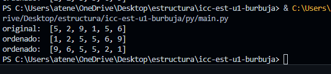
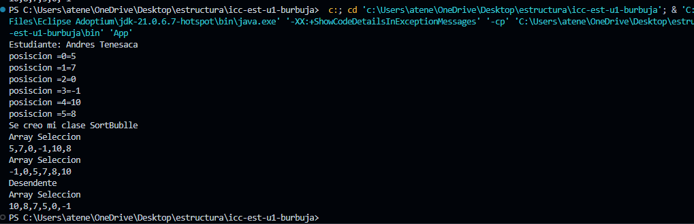

# Estructuta de datos
**Esdiantes:** Andres Tenesaca

## Metodos Ordenamiento

### Practica 1 - 20/OCT
Metodo Sort Bubble
### Practica 2 - 21/OCT

metodo Sort Selecction en Java y Python

Salida de Python

Salida de java

